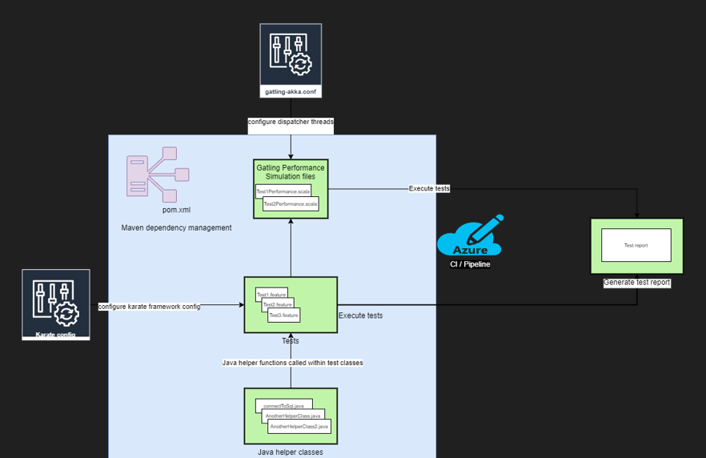

# Karate DSL test automation framework

## Project overview
The project is based on the [karate.io](https://www.karatelabs.io) framework. \
Github repository: https://github.com/karatelabs/karate

## Why?
As Pink roccade local government QA, we require the ability to run automated API tests for each test suite / case. \
We also require the ability to create automation tests as fast as possible and as effectively as possible.

- additional:
We require the ability to run performance tests against our API endpoints without additional overhead and overwhelming complexity.

## How?
The end goal, using the Karate DSL framework, is to automate each API test scenario using a BDD inspired format which is easy to adopt and manage which also allows us to create test cases as fast, readable and accurate as possible.

- additional:
The Karate DSL framework also integrates effortlesly with the Gatling performance test framework. This allows us to easily create performance tests by simply re-using our existing API tests. Thus reducing complexity and time spent creating and maintaining a separate performance test project with its own set of dependencies, setup and code base.

## Dependencies
- Apache Maven (latest version): https://maven.apache.org/download.cgi
- Java 17 or higher: https://www.oracle.com/za/java/technologies/downloads/#java17

## Programming language used
- Karate BDD / Gherkin (mainly for test creation)
- Java (used for creating additional helper functions)
- Scala (used for the creation of performance tests)
- JavaScript (used for project config updates)

## Architecture overview



## Coding practices

Our test automation frameworks shoul always adhere to the [S.O.L.I.D](https://www.digitalocean.com/community/conceptual-articles/s-o-l-i-d-the-first-five-principles-of-object-oriented-design) principles.

## The D.R.Y principle

Our test automation frameworks should always adhere to the [D.R.Y](https://thevaluable.dev/dry-principle-cost-benefit-example/) principle.

## Getting started
- Clone the repository
- Download the latest version of apache maven
- Download java version 17

## Creating an automation test

In the below test example, we have a rather straight forward test. This is an example of how we can use our test scenarios as intended. There is no over complication in the implementation other than focussing on the main objective by executing the test case.

``` gherkin

Feature: get all tags tests

Background:
    * url baseUrl
    * path '/api/tags'

Scenario: get list of tags
    When method Get
    * def taglist = response
    Then status 200

```

## Creating a performance test
Performance tests will leverage off of our existing API tests scenarios and instead only focus on specifying the performance simulation.

``` scala
package performance;

import com.intuit.karate.gatling.PreDef._
import io.gatling.core.Predef._
import scala.concurrent.duration._

class PerfTest extends Simulation {

    val protocol = karateProtocol()

    protocol.nameResolver = (req, ctx) -> req.getHeader("karate-name");

    // Create scenario veriables and specify scenario name and path to feature file
    val getTagList = scenario("get list of tags").exec(karateFeature("classpath:examples/performance/getTags.feature"))

    // Inject the scenario into the simulation
    setUp(
      getTagList.inject(
        atOnceUsers(1),
        nothingFor(4 seconds),
        constantUsersPerSec(1) during (10 seconds),
        constantUsersPerSec(2) during (10 seconds),
        rampUsersPerSec(2) to 10 during (20 seconds),
        nothingFor(5 seconds),
        constantUsersPerSec(1) during (5 seconds)
        ).protocols(protocol)
    )
}
```

## Running tests from command line
The below command will run all tests in the project
``` bash
mvn test
```

To run a specific test you can use the below command
``` bash
mvn test -Dtest=ExamplesTest
```

To run all performance tests
``` bash
mvn clean test-compile gatling:test
```

Please review the karate documentation for more information: https://github.com/karatelabs/karate

## Viewing the test report

We are able to view the test report for a completed test run by navigating to the following files:

- target/gatling
- target/karate-test-reports